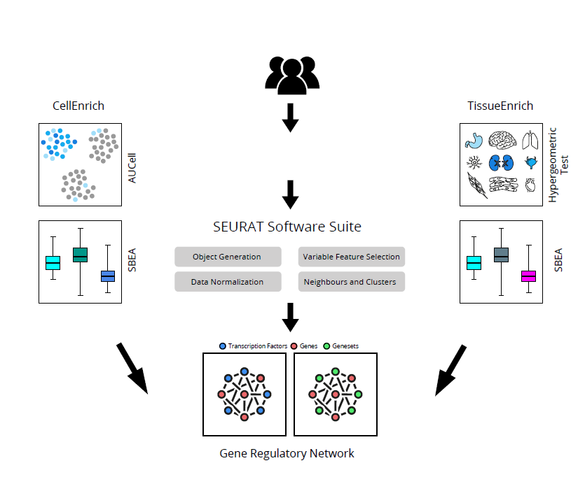

# EcTracker
There are two main R files which are used in App i.e. server.R and ui.R. 
## Workflow

### Files in folder with named signature
There is a separate folder for all the files for the signatures.
### Installation of the libraries
All the libraries can be installed by two main commands i.e. install.packages(“Package_name”) or install.packages("BiocManager") BiocManager::install("Package_name")
